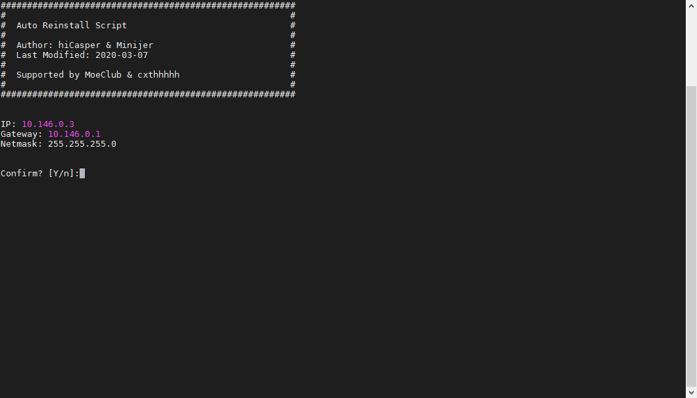
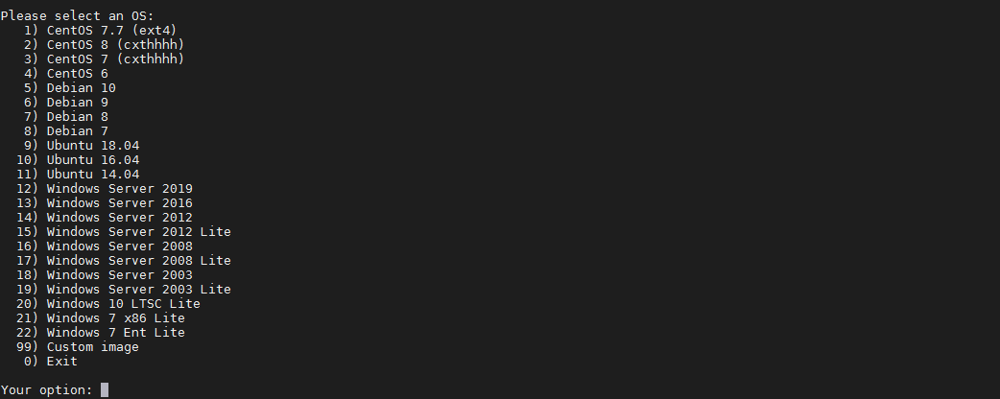

# 一键DD脚本
一键DD脚本，支持性好，更智能更全面。

# 安装重装系统的前提组件:

Debian/Ubuntu:

```shell
apt-get install -y xz-utils openssl gawk file wget screen && screen -S os
```

RedHat/CentOS:

```shell
yum install -y xz openssl gawk file glibc-common wget screen && screen -S os
```

# 如果出现异常，请刷新Mirrors缓存或更换镜像源。

RedHat/CentOS:

```shell
yum makecache && yum update -y
```

Debian/Ubuntu:

```shell
apt update -y && apt dist-upgrade -y
```

## 使用:

```shell
wget --no-check-certificate -O AutoReinstall.sh https://raw.githubusercontent.com/fcurrk/reinstall/master/AutoReinstall.sh && chmod a+x AutoReinstall.sh && bash AutoReinstall.sh
```


输入Y确认DD后主机自动获取IP，N则自行设置IP
输入N后会自动检测出主机现用IP，如果正确可以按Y确认使用，如不正确则按N自行按正确的输入。

22合1的系统一键DD选择界面，输入99则使用自定义镜像。
以上系统密码不为默认密码的均为网络收集，如有疑虑使用自己的自定义镜像。

# 22合一系统密码：

 1、CentOS 7.7 (已关闭防火墙及SELinux，默认密码Pwd@CentOS)
 
 2、CentOS 8 (默认密码cxthhhhh.com，不建议使用)
 
 3、CentOS 7 (默认密码cxthhhhh.com)
 
 4、CentOS 6 (默认密码Minijer.com)
 
 5、Debian 10 (默认密码Minijer.com)
 
 6、Debian 9 (默认密码Minijer.com)
 
 7、Debian 8 (默认密码Minijer.com)
 
 8、Debian 7 (默认密码Minijer.com)
 9、Ubuntu 18.04 (默认密码Minijer.com)
10、Ubuntu 16.04 (默认密码Minijer.com)
11、Ubuntu 14.04 (默认密码Minijer.com)
12、Windows Server 2019 (默认密码cxthhhhh.com)
13、Windows Server 2016 (默认密码cxthhhhh.com)
14、Windows Server 2012 (默认密码cxthhhhh.com)
15、Windows Server 2012 Lite (默认密码WinSrv2012r2)
16、Windows Server 2008 (默认密码cxthhhhh.com)
17、Windows Server 2008 Lite (默认密码WinSrv2008x64-Chinese)
18、Windows Server 2003 (默认密码Linode)
19、Windows Server 2003 Lite (默认密码WinSrv2003x86-Chinese)
20、Windows 10 LTSC Lite (默认密码www.nat.ee)
21、Windows 7 x86 Lite (默认密码Windows7x86-Chinese)
22、Windows 7 Ent Lite (默认密码www.nat.ee)
